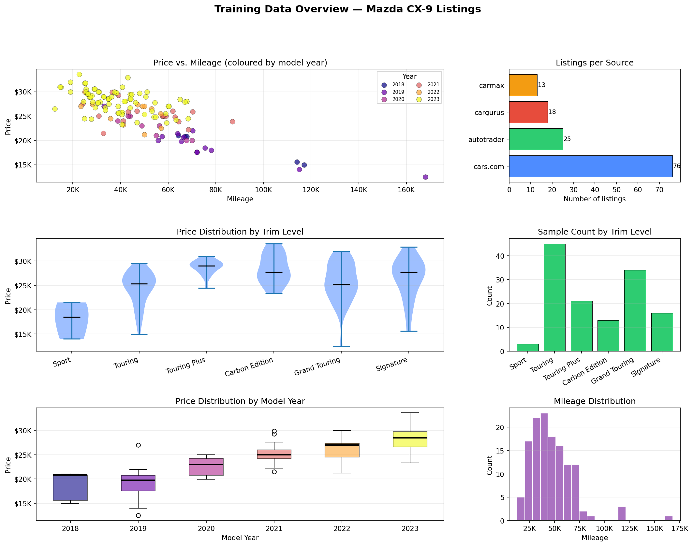
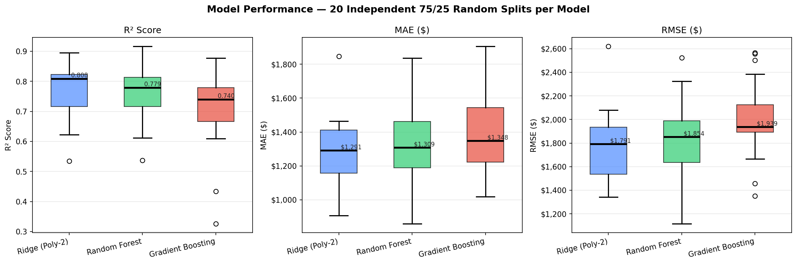
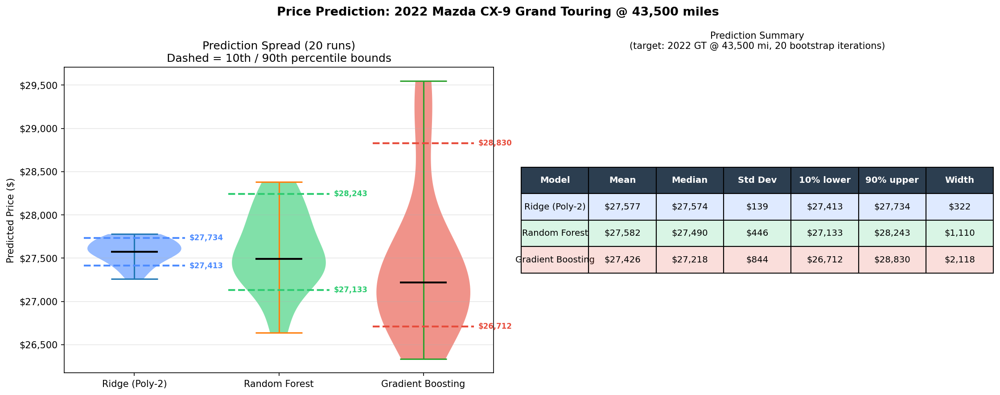
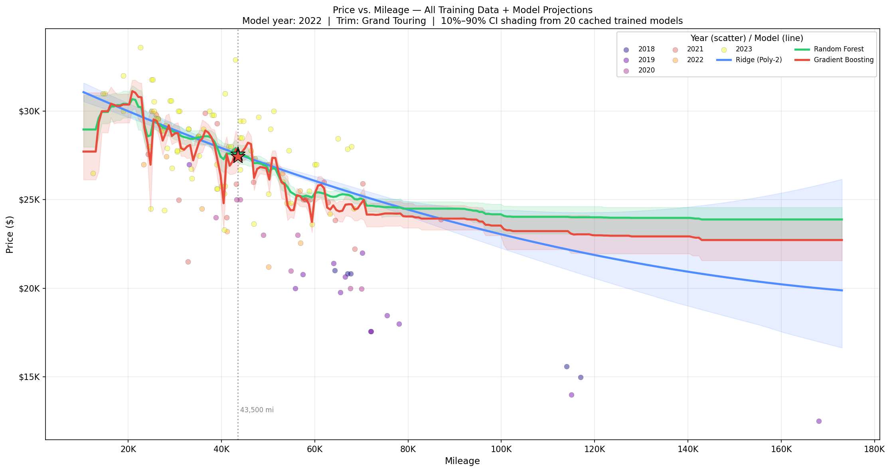
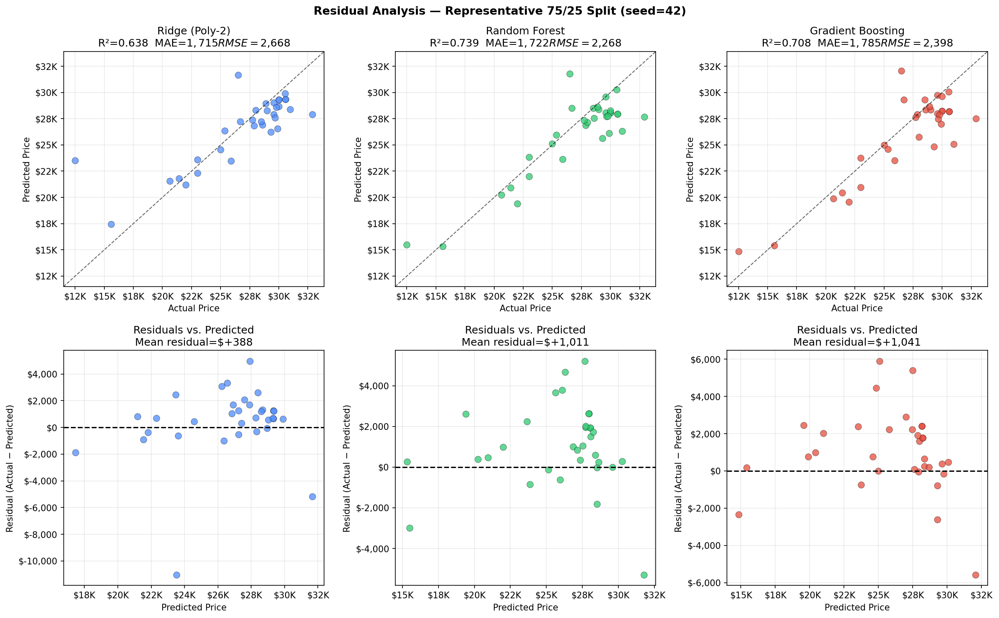
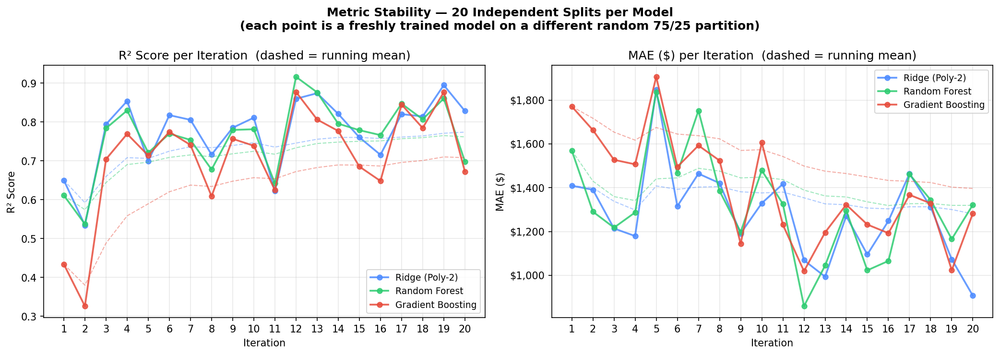
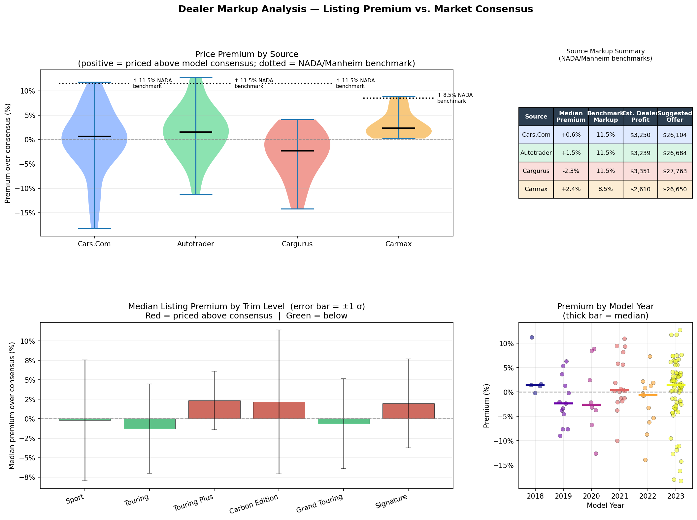
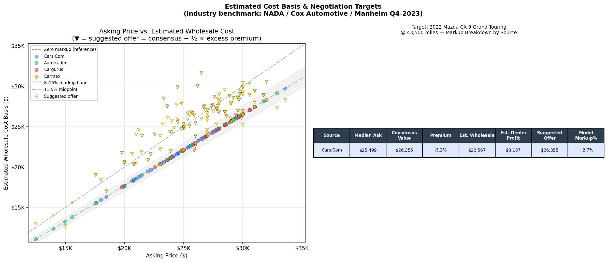

# Mazda CX-9 — Market Pricing Analysis

Scrapes used-car listing pages saved from four major marketplaces, extracts
year / mileage / trim features from each listing, and trains three scikit-learn
regression models to estimate fair-market value.  The full pipeline runs end-to-end
from raw HTML to a six-figure illustrated report in a single command.

---

## Data

### Sources

Listing pages were saved directly from the browser (*File → Save Page As →
Web Page, Complete*) for the Sacramento, CA metro area, filtered to
Mazda CX-9 model years 2018 and newer.

| Source | Listings scraped | Notes |
|---|---|---|
| Cars.com | 76 | `<fuse-card data-listing-id>` web components |
| AutoTrader | 25 | `data-cmp` attribute selectors |
| CarGurus | 18 | `data-cg-ft` attribute selectors |
| CarMax | 13 | `.kmx-car-tile` Material UI cards |
| **Total** | **132 clean** | 143 unique rows; 11 removed by quality filters |

### Features extracted

| Feature | Type | Notes |
|---|---|---|
| `year` | int | Model year; 2018–2023 in this dataset |
| `mileage` | int | Odometer miles |
| `trim` | ordinal str | One of six canonical levels (see below) |
| `price` | float (target) | Asking price in USD |

Trim levels are encoded as an ordered categorical so the model treats
higher trims as proportionally more valuable:

```
sport  <  touring  <  touring plus  <  carbon edition  <  grand touring  <  signature
```

### Coverage summary

| Dimension | Range / Breakdown |
|---|---|
| Price | $12,500 – $33,599  (mean $25,962, median $26,723) |
| Mileage | 12,433 – 168,000 mi  (mean 47,083) |
| Years | 2018 × 5 · 2019 × 13 · 2020 × 8 · 2021 × 18 · 2022 × 13 · 2023 × 75 |
| Trims | sport × 3 · touring × 45 · touring plus × 21 · carbon edition × 13 · grand touring × 34 · signature × 16 |



---

## Modelling approach

`report.py` runs the following steps automatically:

1. **Parse** all HTML files under `for-sale-listings/` and write
   `for-sale-listings/__processed/listings.csv`.
2. **Quality-filter** rows: price $5,000–$60,000, mileage ≤ 200,000,
   year ≥ 2018, trim must be one of the six canonical levels.
3. **Train each model type 20 times** using independent random 75 / 25
   train / validation splits (seeds 7, 20, 33 … 254).
4. **Record per-iteration metrics**: R², MAE, RMSE, and a prediction for
   the target vehicle on every run → `models/model_results.csv`.
5. **Generate six figures** summarising data diversity, model comparison,
   prediction confidence intervals, and residual analysis.

### Models

| Model | Pipeline |
|---|---|
| **Ridge (Poly-2)** | `StandardScaler` → `PolynomialFeatures(degree=2)` → `Ridge(α=1)` |
| **Random Forest** | `StandardScaler + OrdinalEncoder` → `RandomForestRegressor(200 trees, max_depth=6)` |
| **Gradient Boosting** | `StandardScaler + OrdinalEncoder` → `GradientBoostingRegressor(300 trees, lr=0.05)` |

Numeric features (year, mileage) are standardised; trim is ordinal-encoded
using the six-level order above.

---

## Results

### Model performance (20 independent 75/25 splits each)

| Model | Mean R² ± σ | R² range | Median MAE | Mean RMSE |
|---|---|---|---|---|
| Ridge (Poly-2) | **0.774 ± 0.092** | 0.534–0.895 | **$1,291** | **$1,781** |
| Random Forest | 0.762 ± 0.093 | 0.537–0.916 | $1,309 | $1,830 |
| Gradient Boosting | 0.708 ± 0.136 | 0.326–0.877 | $1,348 | $2,001 |

Ridge is the most consistent performer on this dataset, likely because the
relationship between year/mileage and price is close to quadratic and the
small sample size (132 rows) rewards a regularised parametric model.
Gradient Boosting shows the highest variance across splits, indicating it
is more sensitive to which 25 % of the data ends up in the validation set.



### Target vehicle prediction

**2022 Mazda CX-9 Grand Touring @ 43,500 miles**

| Model | Mean prediction | 10th %ile | 90th %ile | CI width |
|---|---|---|---|---|
| Ridge (Poly-2) | $27,577 | $27,413 | $27,734 | **$322** |
| Random Forest | $27,582 | $27,133 | $28,243 | $1,110 |
| Gradient Boosting | $27,426 | $26,712 | $28,830 | $2,118 |

All three models converge on a fair-market value of roughly **$27,400–$27,600**.
The confidence intervals are derived from the spread of predictions across the
20 independent training runs and reflect how sensitive each model type is to
the particular training sample drawn.



### Price vs. mileage with confidence bands

Mean model lines are drawn across the full mileage range for the target year (2022)
and trim (Grand Touring).  Shaded bands show the 10%–90% prediction interval
derived from the 20 cached trained models.  ★ marks the mean prediction for the
target vehicle.



### Residual analysis

Actual vs. predicted and residuals vs. predicted for each model on a single
representative 75/25 split (seed 42).  A perfectly calibrated model would
have all points on the diagonal (top row) and a flat residual cloud centred
on zero (bottom row).



### Metric stability across iterations

Each point is one independently trained model on a fresh random split.
The dashed line is the running mean.  Flat running means indicate stable
generalisation; a rising or falling trend would indicate data-order sensitivity.



---

## Dealer markup estimation

`models/markup.py` estimates how much dealer profit is embedded in each listing
using two complementary methods, then trains a secondary GBM to predict expected
premium from vehicle features.

### Method A — within-dataset premium

The Ridge model (trained on all 132 listings) produces a *market consensus value*
for every vehicle given its year, mileage, and trim.  The gap between the actual
asking price and that consensus is the **relative premium**:

```
premium % = (asking_price − consensus_price) / consensus_price × 100
```

Positive values mean the seller is asking above average for that vehicle;
negative means below.

### Method B — industry-benchmark wholesale reconstruction

Each listing's estimated wholesale (dealer cost) basis is back-calculated from
published industry margin benchmarks (see [Sources](#dealer-markup-sources) below):

```
est_wholesale = asking_price × (1 − source_margin)
est_dealer_profit = asking_price − est_wholesale
negotiation_target = consensus_price − ½ × max(0, dollar_premium)
```

| Source | Benchmark markup | Basis |
|---|---|---|
| CarMax | 8.5 % | CarMax FY2024 10-K: ~$2,220 GPU per unit |
| AutoTrader | 11.5 % | Franchise dealers; NADA / Manheim midpoint |
| CarGurus | 11.5 % | Franchise / independent dealer mix |
| Cars.com | 11.5 % | Similar franchise / independent mix |

An age correction adds +0.5 % per model year of age (older vehicles carry
higher reconditioning and uncertainty costs per NADA data).

### Results — premium by source

| Source | Median premium vs. consensus | Benchmark markup |
|---|---|---|
| AutoTrader | +1.5 % | 11.5 % |
| CarGurus | −2.3 % | 11.5 % |
| CarMax | +2.4 % | 8.5 % |
| Cars.com | +0.6 % | 11.5 % |

The overall median premium is **+0.8 %** with σ = 6.1 %, meaning most listings
are priced within one standard deviation of the model consensus.  CarGurus
listings skew slightly below consensus (dealers competing on price), while
CarMax listings skew slightly above (fixed no-haggle pricing with reconditioning
premium).



### Target vehicle — 2022 Grand Touring @ 43,500 mi

| Metric | Value |
|---|---|
| Median asking price (dataset) | $25,499 |
| Model consensus value | $26,355 |
| Premium vs. consensus | −3.2 % (below market average) |
| Est. wholesale basis (11.5 % midpoint) | $22,567 |
| Est. dealer profit | $3,187 |
| Suggested offer | $26,355 |

The single 2022 Grand Touring listing in the dataset is priced **below** the
model consensus, which means it likely represents fair or even below-average
value.  The suggested offer equals the consensus value (no above-market premium
to split back).

**Expected premium by source** (MarkupModel GBM prediction for target spec):

| Source | Expected premium over consensus |
|---|---|
| AutoTrader | +4.6 % |
| CarGurus | +0.5 % |
| Cars.com | +2.7 % |
| CarMax | +6.1 % |



---

## Dealer markup sources

Quantifying how much profit is embedded in a used-vehicle asking price requires
combining several industry data streams, since dealers do not publish cost
basis directly.

### NADA Annual Data

The **National Automobile Dealers Association (NADA)** publishes aggregated
financial data for franchised dealerships in its *Annual NADA Data* report
(publicly available at nada.org).  Key figures used here:

- **Average used-vehicle front-end gross profit: ~$2,337 / unit** (2023 data,
  down from pandemic-era peaks of $4,000+ in 2021–2022)
- "Front-end gross" is the difference between the sale price and the dealer's
  cost basis (acquisition + reconditioning); it excludes back-end income such
  as F&I products and manufacturer holdback.
- Historical norm before 2020: **$1,800–$2,200 / unit**.

### Cox Automotive / Manheim Market Report

**Cox Automotive** operates the Manheim wholesale auction network — the largest
used-vehicle auction in the US — and publishes quarterly *Manheim Market Reports*
and monthly *Used Vehicle Value Index* reports (publicly summarised at
manheim.com and coxautoinc.com).

- **Wholesale-to-retail spread** (the percentage by which retail asking prices
  exceed the wholesale auction price): returned to **10–14 %** of retail in
  2023–2024 after the post-pandemic spike to 20–30 % in 2021–2022.
- The midpoint of **11.5 %** is used as the baseline benchmark in this analysis.
- Spread varies by segment: mainstream SUVs (including the CX-9) sit near the
  midpoint; luxury and high-demand vehicles trend higher.

### CarMax FY2024 10-K (SEC filing)

**CarMax** (NYSE: KMX) discloses per-unit GPU (gross profit per unit) in its
annual 10-K filing with the SEC:

- FY2024 used-vehicle per-unit GPU: **$2,220**
- CarMax operates a fixed, no-haggle pricing model so this figure is unusually
  transparent.  It implies a margin of roughly **8–9 %** on their typical
  retail price point.
- Source: CarMax FY2024 Annual Report (Form 10-K), filed April 2024,
  *"Retail Vehicle Sales — Gross Profit"* section.

### iSeeCars / market research

**iSeeCars.com** regularly publishes analysis of listing price premiums
across dealers and regions, based on millions of scraped listings:

- Average dealer markup above market value fluctuated from **+15–25 %** during
  peak inventory shortages (Q3 2021 – Q2 2022) to roughly **+3–6 %** by late 2023.
- Certified Pre-Owned (CPO) listings typically carry a **2–4 % premium** above
  equivalent non-CPO listings.

### Summary: what to expect at the negotiating table

| Scenario | Typical front-end gross | As % of $27,500 ask |
|---|---|---|
| CarMax (no-haggle) | ~$2,200 fixed | ~8 % |
| Franchise dealer (high-volume) | $1,800–$2,500 | 7–9 % |
| Franchise dealer (standard) | $2,200–$3,000 | 8–11 % |
| Independent dealer | $2,500–$4,000 | 9–15 % |
| Post-pandemic norm (2023–2025) | $2,000–$2,800 | 7–10 % |

A reasonable opening offer is **consensus value − 3–5 %** of the asking price,
working up toward the consensus value.  Listings already priced below consensus
(negative premium) offer less room and may already represent good value.

---

## Setup & usage

```bash
python3 -m venv .venv
source .venv/bin/activate
pip install -r requirements.txt

# Full report (parses all HTML, trains 60 models, writes 6 figures)
python report.py

# Or run the lighter interactive script
python analyze.py --model gbm --mileage 43500 --year 2022 --trim "grand touring"
```

### Adding new data

1. Save a search-result page from any supported site as an HTML file into
   the appropriate subfolder of `for-sale-listings/`.
2. Re-run `python report.py` — the parser auto-detects the site and the
   CSV and all figures regenerate automatically.

Supported sites: **Cars.com**, **AutoTrader**, **CarGurus**, **CarMax**.

### `analyze.py` CLI reference

| Flag | Default | Description |
|---|---|---|
| `--html-dir` | `for-sale-listings` | Root directory to search for HTML files |
| `--out-csv` | `for-sale-listings/__processed/listings.csv` | Output CSV path |
| `--model` | `gbm` | `ridge` / `rf` / `gbm` |
| `--year` | `2022` | Model year to predict for |
| `--trim` | `signature` | Trim level to predict for |
| `--mileage` | — | Print a fair-price estimate at this mileage |
| `--save-model` | — | Save the fitted pipeline to a `.joblib` file |

---

## Project layout

```
cx9/
├── for-sale-listings/            ← saved HTML search-result pages
│   ├── autotrader/
│   ├── cargurus/
│   ├── carmax/
│   ├── cars_com/
│   └── __processed/
│       └── listings.csv          ← cleaned, deduplicated listing data
├── models/
│   ├── __init__.py
│   ├── pricing.py                ← sklearn pipeline definitions
│   ├── markup.py                 ← dealer markup estimation module
│   └── model_results.csv         ← per-iteration metrics from report.py
├── scraper/
│   ├── __init__.py
│   └── parser.py                 ← BeautifulSoup parsers for each site
├── report/                       ← generated figures (report.py output)
│   ├── 01_data_overview.png
│   ├── 02_model_comparison.png
│   ├── 03_target_prediction.png
│   ├── 04_price_vs_mileage_ci.png
│   ├── 05_residuals.png
│   ├── 06_metric_evolution.png
│   ├── 07_markup_analysis.png
│   └── 08_cost_basis.png
├── report.py                     ← end-to-end report generator
├── analyze.py                    ← interactive CLI script
└── requirements.txt
```
